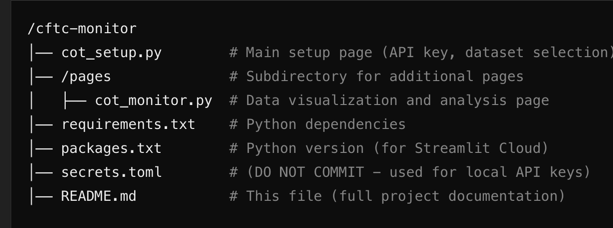

# CFTC Monitor 📊  

A **Streamlit-based dashboard** for monitoring **CFTC reports** using data from **Nasdaq Data Link**.  
This project securely handles API keys using **Streamlit Secrets** (for deployment) and **`secrets.toml`** (for local development).  

---

## 🔧 **Setup & Deployment**  

### **1️⃣ Install Dependencies**  
Before running the app, install the required Python packages:  

pip install -r requirements.txt

This project requires a Nasdaq Data Link API Key, which is handled securely in two ways:

🔹 Local Development (secrets.toml)
For local testing, we use a secrets.toml file to avoid hardcoding API keys in the script.

🔹 Steps to Set Up secrets.toml:
Inside your project folder, create a file called secrets.toml
Add the following inside it:

NASDAQ_API_KEY = "your_actual_api_key_here"

Your app will automatically read this file when running locally.
This keeps API keys secure and out of GitHub.
Never commit secrets.toml to a repository!

Deployment on Streamlit Cloud
For Streamlit Cloud, we use Streamlit Secrets Manager, which securely stores API keys.

 Steps to Set Up Secrets in Streamlit Cloud:
Go to Streamlit Cloud Dashboard
Click "Manage App" → "Secrets"
Add the API Key in the secrets manager

NASDAQ_API_KEY = "your_actual_api_key_here"

Restart the app for changes to take effect.

✅ Why?

Streamlit Cloud encrypts and secures API keys automatically.
It allows safe deployment without exposing secrets in the code.
⚠️ IMPORTANT:

Local = Uses secrets.toml
Streamlit Cloud = Uses Streamlit Secrets Manager
NEVER push secrets.toml to GitHub!

## 🛠 *Project Structure & How Files Work*

📌 How the Pages Work:

cot_setup.py = Main setup page (runs first).

/pages/cot_monitor.py = Loads after setup is completed.

Pulls dataset selections from st.session_state.

Displays charts & allows data filtering.

Streamlit automatically detects pages inside the /pages folder.

✅ If cot_monitor.py doesn’t load, check that st.session_state is set in cot_setup.py.